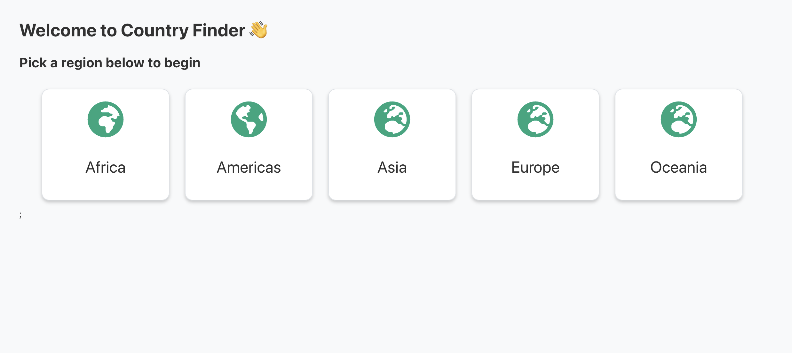
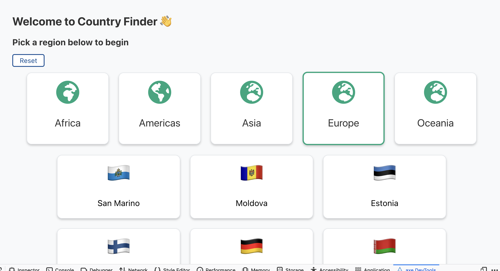
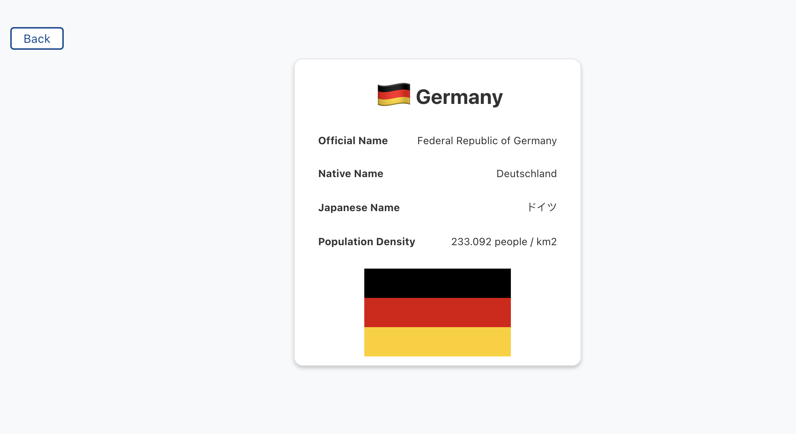
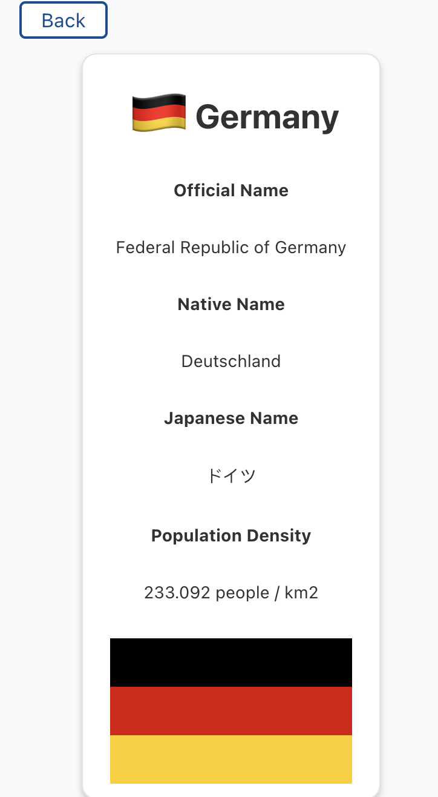

# Country Finder with REST Countries API

### Overview

Users should be able to:

- Choose a region
- Select a country within that region
- Be shown information on that country;
- Common Name + Flag,
- Official Name,
- Native Name,
- Japanese Name,
- Flag as Image,
- Population Density  (population / area)

### Screenshot
Main Page 

Clicked region

Country info

And on mobile

### Built with

- [REST Countries API](https://restcountries.eu/)
- [React](https://reactjs.org/)
- [React Router](https://reactrouter.com/core/guides/quick-start)
- [React Testing Libary](https://testing-library.com/docs/react-testing-library/intro/)
- [Styled Components](https://styled-components.com/)
- Flexbox

### Improvements

Improvements I would like to make to the ui,

- Loading state 
- Improve test coverage
- Move the API calls to an API folder and handle it outwith
- Sorting and filtering countries 
- Put NativeName in CountryData Object
- Search functionality 
- improve responsiveness 

# Getting Started 
In the project directory, 

Before running the project:

### `yarn`
To install packages and dependencies 

### `yarn start`
Runs the app in the development mode.\
Open [http://localhost:3000](http://localhost:3000) to view it in the browser.

### `yarn test`

Launches the test runner in the interactive watch mode.\

